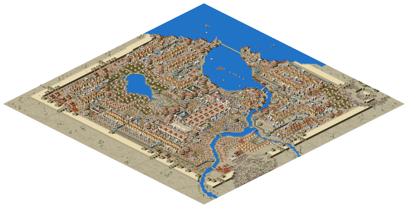

# Augustus 

Chat: [Discord](http://www.discord.gg/GamerZakh) (kindly hosted by GamerZakh)

| Platform | Latest release | Unstable build |
|----------|----------------|----------------|
| Windows  |  |   [(Download development assets)](https://augustus.josecadete.net/download/latest/development/assets) | 
| Linux AppImage |  | 
| Mac |  |  |
| PS Vita | |  |
| Switch |   |  |
| Android APK |   |  |

Alternatively, you can [**try Augustus in your browser**](https://augustus.josecadete.net/play/). Note that you'll still need to provide a valid Caesar 3 installation folder.

Augustus is a fork of the Julius project that intends to incorporate gameplay changes.
=======
The aim of this project is to provide enhanced, customizable gameplay to Caesar 3 using project Julius UI enhancements.

Augustus is able to load Caesar 3 and Julius saves, however saves made with Augustus **will not work** outside Augustus.

Gameplay enhancements include:
- Roadblocks
- Market special orders
- Global labour pool
- Partial warehouse storage
- Increased game limits
- Zoom controls
- And more!

Because of gameplay changes and additions, save files from Augustus are NOT compatible with Caesar 3 or Julius. Augustus is able to load Caesar 3 save files, but not the other way around. If you want vanilla experience with visual and UI improvements, or want to use save files in base Caesar 3, check [Julius](https://github.com/bvschaik/julius).

Augustus, like Julius, requires the original assets (graphics, sounds, etc) from Caesar 3 to run. Augustus optionally [supports the high-quality MP3 files](https://github.com/bvschaik/julius/wiki/MP3-Support) once provided on the Sierra website.

## Running the game

First, download the game for your platform from the list above.

Alternatively, you can build Augustus yourself. Check [Building Julius](doc/BUILDING.md)
for details.

Then you can either copy the game to the Caesar 3 folder, or run the game from an independent
folder, in which case the game will ask you to point to the Caesar 3 folder.

Note that you must have permission to write in the game data directory as the saves will be
stored there. Also, your game must be patched to 1.0.1.0 to use Augustus. If Augustus tells you that
you are missing it, you can [download the update here](https://github.com/bvschaik/julius/wiki/Patches).

See [Running Julius](https://github.com/bvschaik/julius/wiki/Running-Julius) for further instructions and startup options.

## Manual

Augustus changes are explained in detail in the comprehensive manual. Below you can find the links to the manual in a few language versions.

| Language | Manual |
|----------|--------|
|English   |[Download](https://github.com/Keriew/augustus/raw/master/res/manual/augustus_manual_en_3_2.pdf)|
|Chinese   |[Download](https://github.com/Keriew/augustus/raw/master/res/translated_manuals/augustus_manual_chinese_3.0.pdf)|
|French   |[Download](https://github.com/Keriew/augustus/raw/master/res/translated_manuals/augustus_manual_french_3.2.pdf)|
|Polish   |[Download](https://github.com/Keriew/augustus/raw/master/res/translated_manuals/augustus_manual_polish_3.0.pdf)|
|Russian   |[Download](https://github.com/Keriew/augustus/raw/master/res/translated_manuals/augustus_manual_russian_3.0.pdf)|

## Bugs

See the list of [Bugs & idiosyncrasies](https://github.com/bvschaik/julius/wiki/Caesar-3-bugs) to find out more about some known bugs.
