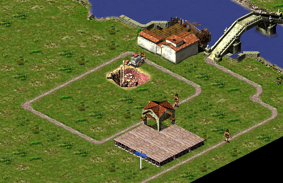
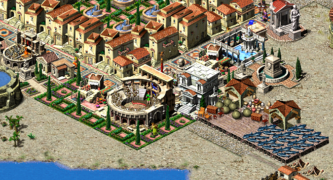

Original bugs & idiosyncrasies
==============================

Julius recreates many bugs that you can find in original Caesar 3 game, to preserve 100% saves compatibility. This is an incomplete list of those bugs and some gameplay idiosyncrasies that you can encounter during the gameplay. Feel free to send a pull request with other bug reports that update this list.

## Warehouseman can't reach a warehouse with a road access

Each building in Caesar 3 is assigned to only one road network. That can result in a situation where a warehouseman cannot reach a given warehouse just because the warehouse has been assigned to another network than the building that's sending a warehouseman (see the image below). To avoid this problem make sure that all your warehouses are adjacent to only one road network.

## Market trader doesn't take goods from the warehouse

Gardens split roads into separate road networks. Even though market trader can use garden tiles as road tiles and pass by a given warehouse, that warehouse (even if full) might be ignored if it's assigned to another road network than market building (each building is assigned to a single road network in Caesar 3). To avoid this problem make sure that market traders traverse your city via road tiles rather than gardens.

## Market trader cannot access food from the warehouse

In original Caesar 3 game, market trader can get food only from granaries, never from warehouses (even though market traders get resources from a warehouse, such as pottery).

## Trade ships appear to buy the wrong resources

If you have one dock and are trading with two cities, it is possible that (1) you will get paid for a few more units of goods in the year than are allowed from the city buying them, (2) that a couple units of goods will show up as being loaded onto a ship from a city that does not trade those goods, and (3) because of the mistakenly loaded goods, that ship will fail to purchase a couple of loads of goods for which it has room and for which you have goods available. More details are available [in this comment](https://github.com/bvschaik/julius/issues/421#issuecomment-618942375).

## More original bugs

For a more comprehensive list of original bugs, along with their current status, please check the [original bug issue reports](https://github.com/bvschaik/julius/issues/labels/original%20bug).
