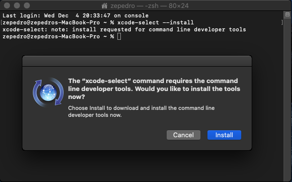
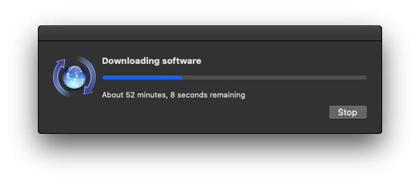

# Building Julius for Mac OS

## Installing the dependencies

In order to be able to build Julius, you need to install the dependencies first.

The dependencies are:

* The command line developer tools;
* Homebrew;
* CMake;
* The `SDL` library;
* The `SDL_mixer` library.

If you already have all of them installed, you can proceed to [build Julius](#building-julius).

### Installing the command line developer tools

To install the command line developer tools, open a terminal window and type:

    $ xcode-select --install

The following window should appear:

Click `Install` and then accept the license agreement.

The developer tools will download and install.

### Installing the remaining dependencies

In order to install the remaining dependencies (CMake, SDL and SDL_mixer), you must first install [Homebrew](https://brew.sh).

Homebrew is a package manager for Mac OS (and also for Linux) which makes it easier to download and install many components such as libraries and developer tools.

In order to install Homebrew, open a Terminal window and type the following:

    $ /usr/bin/ruby -e "$(curl -fsSL https://raw.githubusercontent.com/Homebrew/install/master/install)"

Homebrew will then install. Note that it will take some time.

After Homebrew is installed, it's time to install the remaining dependencies. To do so, type:

    $ brew install cmake sdl2 sdl2_mixer

Then type your superuser password.

After the required dependencies have been installed, you can proceed to build julius.

## Building Julius

1. Navigate to the directory where you want the repository folder to be installed. As an example, we're using the `home` folder:

        $ cd ~

2. Clone the Julius github repository to your computer:

        $ git clone https://github.com/bvschaik/julius.git

3. Move to the new `julius` directory:

        $ cd julius

    **Optional:** If you have already downloaded the Julius repository and only wish to update it (in order to build a newer version), instead of the previous three steps, do the following in a terminal window:

    a. Move to the `julius` directory where the repository was installed.

    b. Type:

            $ git pull origin master

    c. Delete the `build` directory:

            $ rm -rf build

    d. Proceed to step 4.

4. Create a `build` directory and move to it:

        $ mkdir build && cd build

5. Run `cmake`:

        $ cmake ..

6. Build Julius:

        $ make

    The game will be built to the `build` directory inside the main folder.

7. Test that everything is working:

        $ make test

**Success!** Julius should have been built without any errors. You can now move it to the `Applications` folder to execute it.
