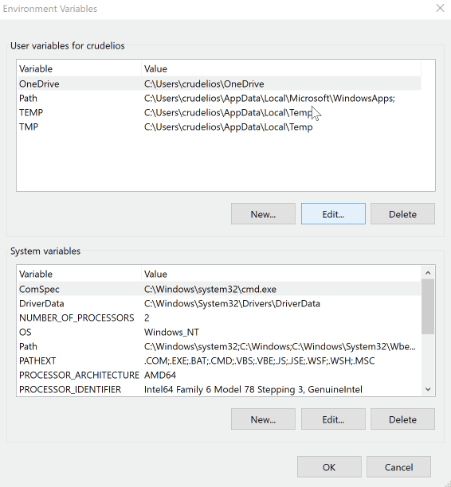

# Building Julius for Windows

You have two main options in how you want to build Julius. You can either:

* [Build using **Microsoft Visual Studio**](#a-using-microsoft-visual-studio-64-bit-build); or
* [Install CMake and MinGW and **use the command line**](#b-using-cmake-and-mingw-via-command-line).

## A. Using Microsoft Visual Studio (64-bit build)

1. Make sure you have [Microsoft Visual Studio](https://visualstudio.microsoft.com/vs/) installed. Please note that only Visual Studio 2017 (fully updated) or Visual Studio 2019 can be directly used.
These instructions assume you are using Visual Studio 2019.

2. Download the `SDL2` and `SDL2_mixer` development libraries, both as a zip file:

	* [SDL2 dev libraries for Visual Studio](https://www.libsdl.org/release/SDL2-devel-2.0.10-VC.zip);
	* [SDL2_mixer dev libraries for Visual Studio](https://www.libsdl.org/projects/SDL_mixer/release/SDL2_mixer-devel-2.0.4-VC.zip).

3. Extract the `SDL2` and `SDL2_mixer` development libraries to an easy to remember folder (I recommend something like `C:\libs`).

4. Open Microsoft Visual Studio. Select `Clone or check out code`.
 
 	

5. In the `Repository location` option, type `https://github.com/bvschaik/julius.git`.
   In the `Local path` option, select in which folder you wish the source to be downloaded to. This will be your `work folder`:

    

    Alternatively, you can obtain the source code without using Visual Studio's built in Git integration. Check [obtaining the source files for Julius](#obtaining-the-source-files-for-julius) for details.

6. The first time you open the project, Visual Studio will throw an error complaining it can't find SDL:

	

7. You will need to tell Visual Studio where the SDL libraries you downloaded can be found. To do that, click up top where it says `x64-Debug` and select `Manage Configurations`.

8. On the new screen that appears, scroll down to `CMake Command Arguments`.

9. Paste the location of your library paths. If you used the above example paths, then paste the following code:

	`-DCMAKE_PREFIX_PATH=C:\\libs\\SDL2-2.0.10;C:\\libs\\SDL2_mixer-2.0.4`

	Notice that you must always include `-DCMAKE_PREFIX_PATH=` at the start and that you must use double backward slashes.

	

10. Press `CTRL` + `S` to save the configuration. Visual Studio will attempt to reconfigure everything, and this time it should detect the libraries and work.

11. Pick `Select Startup Item` up top and select `julius.exe`.

	

12. Go to `Build -> Build All`. The game should compile without errors.

13. After the game compiles, it is stored in a folder inside your `work folder`. You can access it from `work folder\out\build\x64-Debug`.

14. If you simply execute the game right now, it will complain about missing DLL's. You need to copy the `SDL2` and `SDL2_mixer` DLL's to the same directory as the executable.

	Both libraries are available inside your library directory. Using the example library location, the files should be in the following location:

	* `SDL2` - `C:\libs\SDL2-2.0.10\lib\x64`
	* `SDL2_mixer` - `C:\libs\SDL2_mixer-2.0.4\lib\x64`

**Success!** You should now be able to run the game.

## B. Using CMake and MinGW via command line

Building Julius by command line is useful if you don't wish to install a very large IDE such as Visual Studio. However, it still requires that you install some programs, such as CMake, MinGW and optionally Git.

### Installing the prerequesite programs

#### Installing MinGW

MinGW stands for *Minimalist GNU for Windows* and is a set of programs and tools that allow the compilation of the source files to an executable.

In order to properly install MinGW, do the following:

1. Obtain [`mingw-get-setup.exe`](https://osdn.net/projects/mingw/downloads/68260/mingw-get-setup.exe) and proceed to install it. The default options are good enough.

2. When the installation is finished, click `Continue` to start the package manager:

    

3. Install the required MinGW packages:

    * On the right pane, right-click `mingw-developer-toolkit-bin` and select `Mark for Installation`. This may take a while to process.
    * On the left pane, pick `Basic setup`.
    * On the right pane, right-click `mingw32-base-bin` and select `Mark for Installation`.
    * Go to `Installation -> Apply Changes`.
    * On the new window, click `Apply`.

    

4. This will take a while. After the packages have installed, you can click `Close` to exit the installer:

    

5. The only thing left to do is to add the MinGW binaries to the `path`:

    * In the start menu, type `environment variables` and select `Edit the system environment variables`.
    * In the new window that appears, select `Environment Variables`:

        

    * On the new window that appears, at the top list, select the `Path` variable and click `Edit`.
    * On the new window that appears, select `New` and type `C:\MinGW\bin`.
    * Click `OK` on all windows to confirm.

        

6. MinGW is now installed.

#### Installing CMake

CMake is the tool that tells MinGW which files to compile and what options to use.

Open the [download page for CMake](https://cmake.org/download/) and select the file from the `Windows win64-x64 Installer` option to install. 

During install, check the option `Add CMake to the system PATH for the current user`:

#### Installing Git for Windows (optional)

Git is a source control system, allowing the local source code to be updated by only downloading the relevant changes instead of the entire codebase. This program is optional.

If you wish to install it, [download it from the `gitforwindows` website](https://gitforwindows.org), which provides an user interface as well as the command line tools. The default installation options are enough for Julius.

### Obtaining SDL2 and SDL2_mixer

1. Download the `SDL2` and `SDL2_mixer` development libraries, both as a zip file:

	* [SDL2 dev libraries for MinGW](https://www.libsdl.org/release/SDL2-devel-2.0.10-mingw.tar.gz);
	* [SDL2_mixer dev libraries for MinGW](https://www.libsdl.org/projects/SDL_mixer/release/SDL2_mixer-devel-2.0.4-mingw.tar.gz).

2. Extract the `SDL2` and `SDL2_mixer` development libraries to an easy to remember folder (I recommend something like `C:\libs`).

    * If you can't extract `.tar.gz` files, [obtain 7-Zip](https://www.7-zip.org/).
    * For each one of the downloaded libraries, after opening the `.gz` file in 7-Zip, open the single `.tar` file that appears on the 7-Zip window and extract its contents:

        

### Obtaining the source files for Julius

You have two options regarding on how to obtain the source code for Julius. The simplest, but not recommended one, is [downloading the `julius` repository as a zip file](https://github.com/bvschaik/julius/archive/master.zip).

While doing this will work, you will have to download the entire source again if there are any updates to the game which you wish to build yourself. So only directly download the source if you're sure you want to do it just once.

Still, if you download the contents as a zip file, extract them to a folder, which will be your `work folder`. You can now proceed to [build Julius](#building-julius).

The best approach, however, is to use Git for Windows, since it allows you to keep up with changes to the source code.

If you followed the optional section about installing Git, keep reading. If not, follow [installing Git for Windows](#installing-git-for-windows-optional) before proceeding.

To obtain the source from Git, follow the following steps:

1. Press `Shift` and right-click with the mouse on the folder where you wish to download the source to.

2. Select `Open PowerShell window here` or `Open command window here`.

3. On the command window, type:

        > git clone https://github.com/bvschaik/julius.git

**Optional:** If you already have the source files from Git and simply wish to update them (in order to build a newer version), repeat above steps 1. and 2. and type:

        > git pull origin master

If you then wish to proceed building Julius, delete the `build` folder and proceed to [build Julius](#building-julius) normally.

### Building Julius

1. Open the folder where you downloaded the source files to.

2. Press `Shift` and right-click with the mouse on the `julius` folder and select `Open PowerShell window here` or `Open command window here`.

3. Create a `build` directory and move to it:

        > mkdir build
        > cd build

4. Run `cmake`:

        > cmake .. -G "MinGW Makefiles" "-DCMAKE_PREFIX_PATH=C:\libs\SDL2-2.0.10\i686-w64-mingw32;C:\libs\SDL2_mixer-2.0.4\i686-w64-mingw32"

    Replace the contents of `-DCMAKE_PREFIX_PATH=` with the location of the folders where you extracted `SDL2` and `SDL2_mixer` to, and be sure to add the `i686-w64-mingw32` at the end of both locations.

5. Build Julius:

        > mingw32-make

    The game will be built to the `build` directory inside the main folder.

6. Test that everything is working:

        > mingw32-make test

7. If you simply execute the game right now, it will complain about missing DLL's. You need to copy the `SDL2` and `SDL2_mixer` DLL's to the same directory as the executable.

	Both libraries are available inside your library directory. Using the example library location, the files should be in the following location:

	* `SDL2` - `C:\libs\SDL2-2.0.10\i686-w64-mingw32\lib`
	* `SDL2_mixer` - `C:\libs\SDL2_mixer-2.0.4\i686-w64-mingw32\lib`

**Success!** You should now be able to run the game.
